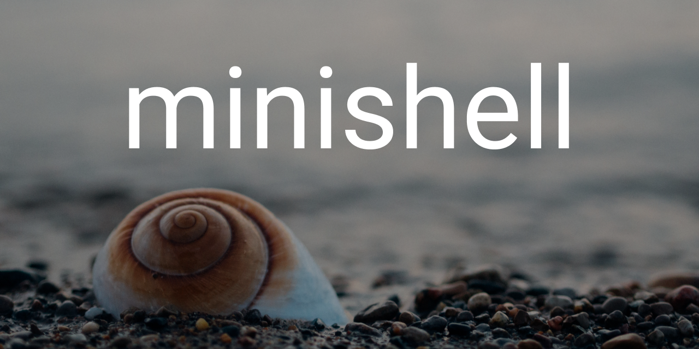
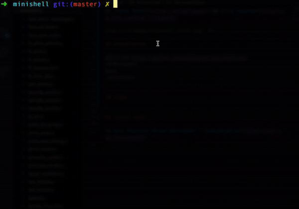
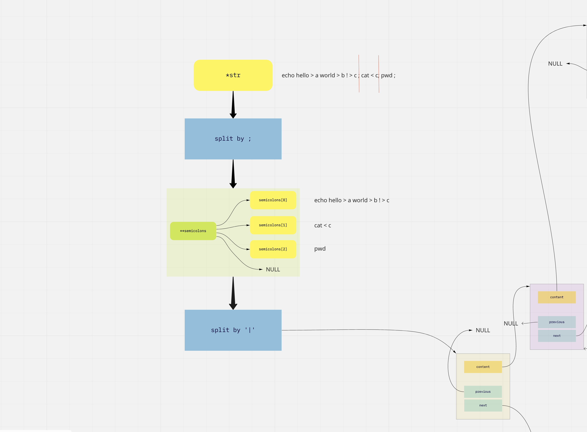
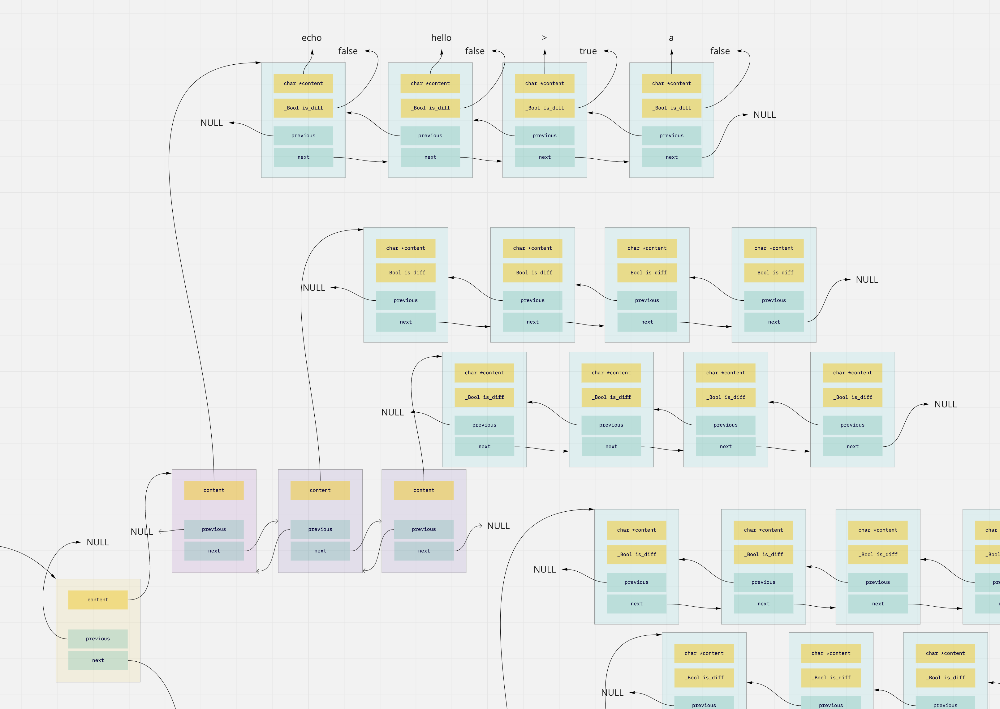
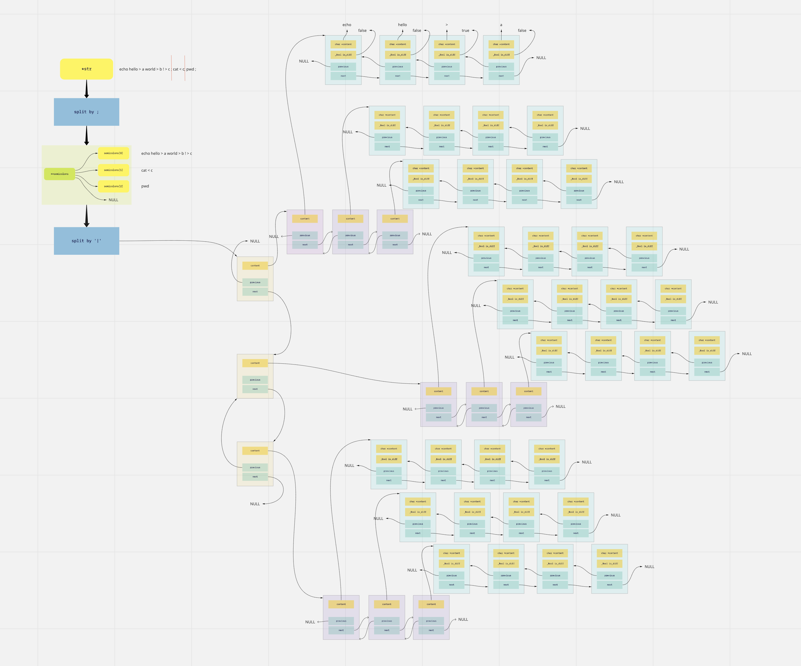

# minishell
School 21 project. Implementation of own minishell.

By [Roman Kukin](github.com/kukinpower) && [Ilia Sagaidak](https://github.com/blueflyingpanda)



## Installation
```
git clone https://github.com/kukinpower/minishell.git
cd Minishell
make
./minishell
```

## Usage


## About project





## Useful links

[▶️ Unix Pipeline (Brian Kernighan) - Computerphile](https://youtu.be/bKzonnwoR2I)

## Credits

Authors: [Roman Kukin](github.com/kukinpower) && [Ilia Sagaidak](https://github.com/blueflyingpanda)

 <span>Shell image on the cover by <a href="https://unsplash.com/@aaronburden?utm_source=unsplash&amp;utm_medium=referral&amp;utm_content=creditCopyText">Aaron Burden</a> on <a href="https://unsplash.com/s/photos/shell?utm_source=unsplash&amp;utm_medium=referral&amp;utm_content=creditCopyText">Unsplash</a></span>