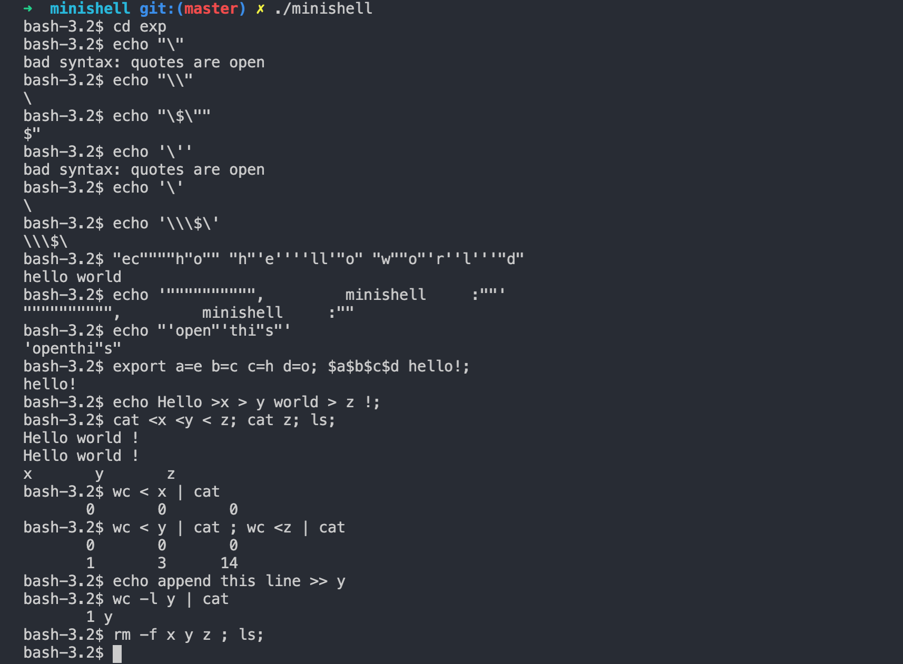

# minishell
School 21 project. Implementation of own minishell.

By [Roman Kukin](github.com/kukinpower) && [Ilia Sagaidak](https://github.com/blueflyingpanda)


## Features
`pipes`, `semicolons`, `escape sequences`, `enviroment variables`, `$?`, `~`, redirections: `>` `>>` `<`

Builtins: `cd`, `pwd`, `echo`, `export`, `unset`, `env`, `exit`.

Signals: `Ctrl-C`, `Ctrl-\`, `Ctrl-D`.

Parser opens quotes `'` `"` like in bash and handles `\` even in `'` `"` different context.

Commands work with absolute and relative paths.

Minishell writes errors to 2, output to 1 and prompt to 0. Acts as bash.



## Installation
```
git clone https://github.com/kukinpower/minishell.git
cd Minishell
make
./minishell
```

## Usage


## About project


## Useful links

[▶️ Unix Pipeline (Brian Kernighan) - Computerphile](https://youtu.be/bKzonnwoR2I)

## Credits

Authors: [Roman Kukin](github.com/kukinpower) && [Ilia Sagaidak](https://github.com/blueflyingpanda)

 <span>Shell image on the cover by <a href="https://unsplash.com/@aaronburden?utm_source=unsplash&amp;utm_medium=referral&amp;utm_content=creditCopyText">Aaron Burden</a> on <a href="https://unsplash.com/s/photos/shell?utm_source=unsplash&amp;utm_medium=referral&amp;utm_content=creditCopyText">Unsplash</a></span>